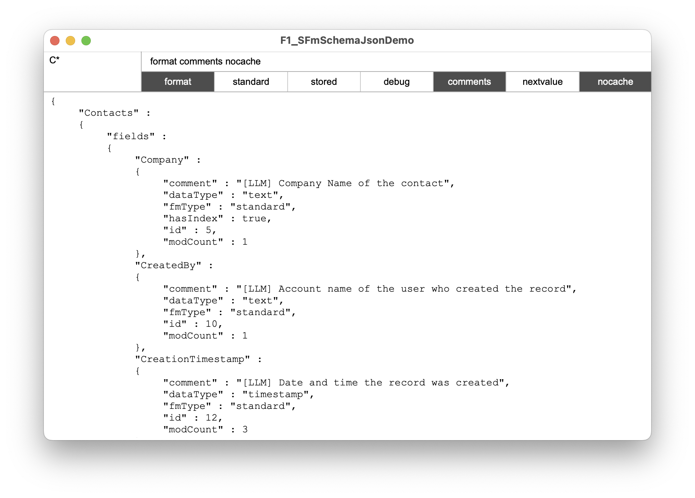

# SFmSchema.json() Custom Function

This Custom Function returns available information on the schema of the file by integrating the data from sources like the internal FileMaker_Tables and FileMaker_Fields tables and the functions FieldType(), FieldComment() and NextSerialValue().

You can filter tables and fields to get only the standard fields where information is primarily stored. 

## Parameters

### _tables

This can be used to filter tables in the current file. You can use list of table names and even wildcards. 

Example: providing "Global¶C*" returns the table 'Global' along with all other tables starting with 'C'

### _options

You can provide one or more keywords to specify the output:

- format: the json output will be formatted
- debug: adds the original outputs from Get( FieldType ) and FileMaker_Fields
- nocache: results are cached in global variable so subsequent calls are significantly faster. For developing or debugging you might want to disable this.
- standard: only standard fields are being returned. Global fields, calculations and summary fields will be excluded from the result.
- stored: like 'standard' but with additional stored calculations.
- comments: includes the field comment from the field definitions.
- nextvalue: includes the next value for auto-incrementing fields like numeric ids.

## Result

The result is a json object with the table names as keys. Every table then is an object with can have the following keys:

- fmType: can either be standard, global, calculation, summary
- dataType: text, number, container, date, time, timestamp
- hasIndex: true if there is an index on the field. False values are omitted.
- id: internal field id
- modCount: number of changes applied to the field's definition
- isStored: only for calculation fields if the value is stored
- repCount: only for repeating fields
- nextValue: optional result from NextSerialValue() function. 
- comment: comment from field definitions, null values are omitted.
- debugFromFunction: result from FieldType()) function.
- debugFromSql: row from internal FileMaker_Fields table

## Demo

The demo file uses the "Contacts" starter solution.

