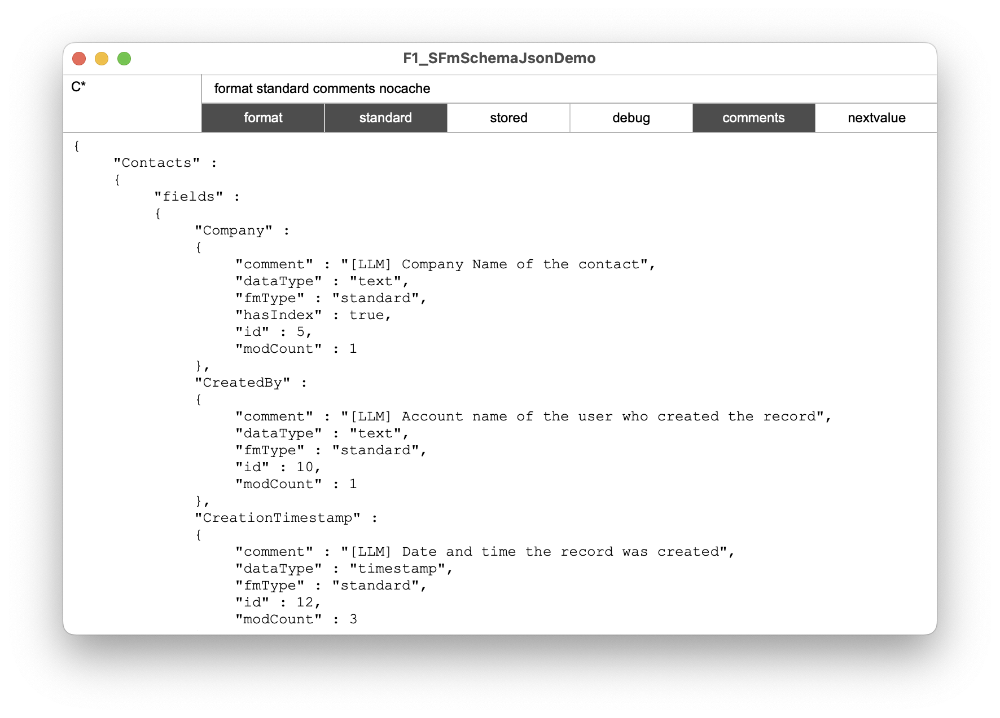

# F1_SFmSchema.json()

This Custom Function returns consolidated information of the file's schema by integrating data from  the internal *FileMaker_Tables* and *FileMaker_Fields* info and from the design functions *FieldType*(), *FieldComment*() and *NextSerialValue*().

You can filter tables and fields to get only the standard fields where information is stored primarily.  

The resulting JSON is cached in a global variable so that repeating calls are cheap. Changing parameter values invalidates the cache. 

## Parameters

### list *_tables*

This can be used to filter tables in the current file. You can use list of table names and even wildcards. 

**Example**: providing "Global¶C*" returns the table 'Global' along with all other tables starting with 'C'

### string *_options*

You can provide one or more keywords to specify the output. You can separate the keywords by space (or any other character for that matter):

- **format**: the json output will be formatted
- **debug**: adds the original outputs from Get( FieldType ) and FileMaker_Fields
- **standard**: only standard fields are being returned. Global fields, calculations and summary fields will be excluded from the result.
- **stored**: like 'standard' but with additional stored calculations.
- **comments**: includes the field comment from the field definitions.
- **nextvalue**: includes the next value for auto-incrementing fields like numeric ids.

## Result

The result is a json object with the table names as keys. For each table fields are returned with the following properties:

- **fmType**: can either be standard, global, calculation, summary
- **dataType**: text, number, container, date, time, timestamp
- **hasIndex**: true if there is an index on the field. False values are omitted.
- **id**: internal field id
- **modCount**: number of changes applied to the field's definition
- **isStored**: only for calculation fields if the value is stored
- **repCount**: only for repeating fields
- **nextValue**: optional result from NextSerialValue() function. 
- **comment**: comment from field definitions, null values are omitted.
- **debugFromFunction**: result from the design functions.
- **debugFromSql**: row from internal FileMaker_Fields table

Additionally, the id, modCount, recordCount and table occurrences are returned for each table.

## Demo

The demo file uses the "Contacts" starter solution.

